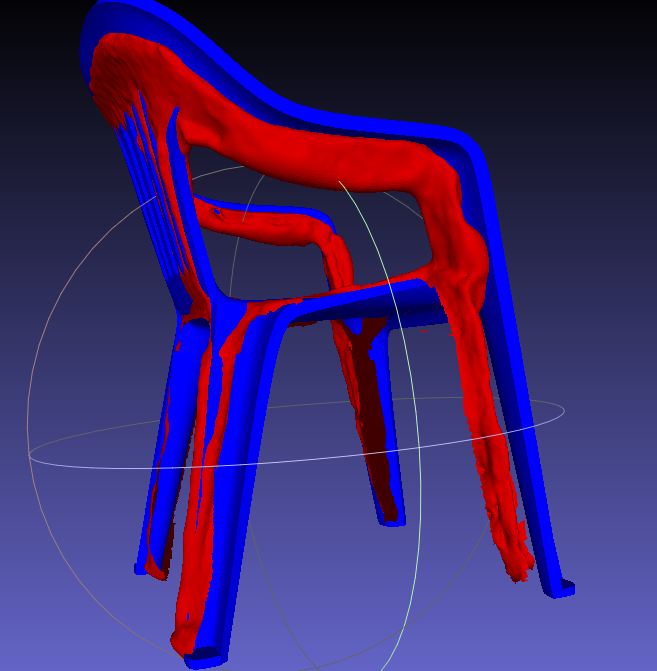

# 3D Model Reconstruction of an Object from a Video

This project took place during my first year at IMT Atlantique, we used solutions like COLMAP and MeshLab to reconstruct 3D models of small objects. The goal of the project was to fine-tune COLMAP parameters to obtain the best performance to precision ratio, for the use-case determined.

In this repo, you will find the final submission of our project, alongside other releavant files.

### *Final result :*

### *Starting model :*

### *Both models  :*

